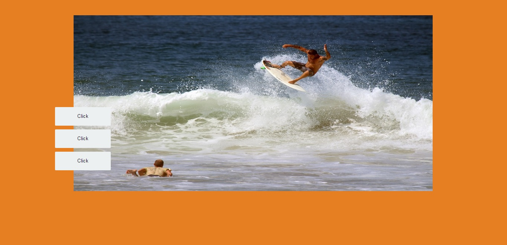

# picture option
Projeto de escolha de imagem, usanDo eventos de click e manipulação do DOM com javascript.

## Neste Projeto foram usados:
- HTML 5
- CSS 3
- Javascript

## Confira a demo do projeto:

<a href="https://thailoeduardo.github.io/picture_option/">Demo</a>
